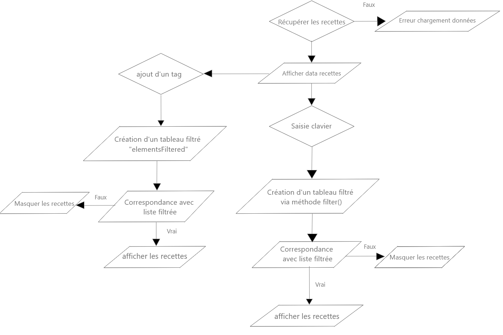

  

# Les petits plats
## Description du projet :

Sur ce projet, je dois créer une page web fonctionnelle de recettes de cuisine à partir d'une maquette fournie et développer un algorithme de recherche de recettes en JavaScript.

## Point important du projet: 
je dois tester 2 versions différentes de l'algorithme et choisir la plus performante lors de sa conception.

## Le lien du projet :

[Lien du site ]()

### Algorigramme

### Comparaison de performance

[Comparaison des performances ](https://jsben.ch/dCYY0)

## Pour lancer le projet: 
cmd: npm install requires